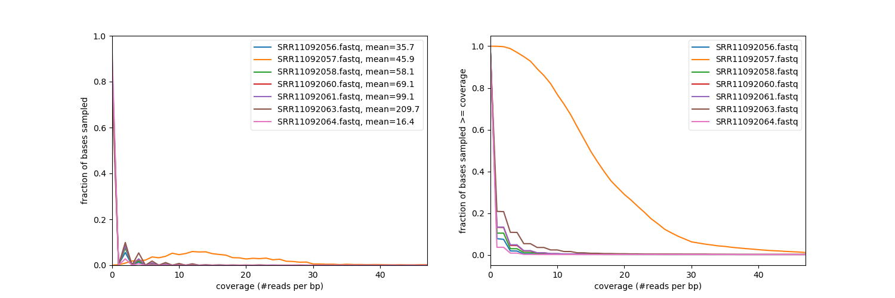
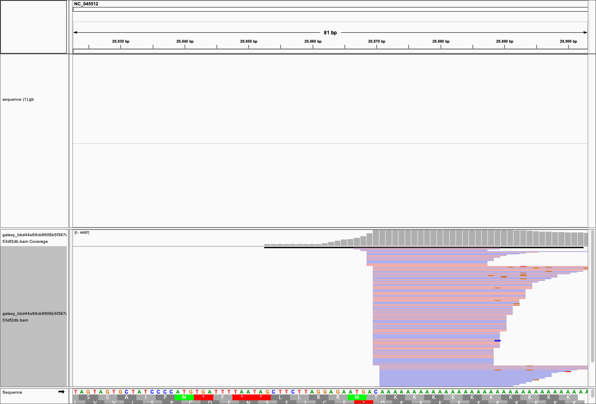

# Analysis of additional data

## February 24, 2020: New data is exceptionally sloppy

[](https://usegalaxy.org/u/aun1/h/covid-19-feb-21-data-analysis) 

As of the morning of Feb 24, 2020 there are 11 additional datasets that appeared at the [COVID-19 data page](https://www.ncbi.nlm.nih.gov/genbank/sars-cov-2-seqs/) maintained by the [NCBI](https://www.ncbi.nlm.nih.gov/). They can be viewed using [SRA run selector](https://trace.ncbi.nlm.nih.gov/Traces/study/?acc=SRR10903401%2CSRR10903402%2CSRR10902284%2CSRR10948474%2CSRR10948550%2CSRR10971381%2CSRR11092058%2CSRR11092057%2CSRR11092056%2CSRR11092064%2CSRR11085797%2CSRR11085737%2CSRR11085740%2CSRR11085733%2CSRR11085736%2CSRR11085738%2CSRR11085741&o=acc_s%3Aa&s=SRR11085797,SRR10948474,SRR10948550,SRR10903402,SRR11092056,SRR11085741,SRR11085737,SRR11085740,SRR11085738,SRR11085733,SRR10902284,SRR11092064,SRR11092057,SRR11085736,SRR10903401,SRR11092058,SRR10971381).

The accessions of new datasets are:

```
SRR11085797
SRR11092056
SRR11085741
SRR11085737
SRR11085740
SRR11085738
SRR11085733
SRR11092064
SRR11092057
SRR11085736
SRR11092058
```

Of these four (SRR11092056, SRR11092057, SRR11092058, SRR11092064) are human metatranscriptomic samples while others (SRR11085797, RR11085741, SRR11085737, SRR11085740, SRR11085738, SRR11085733, SRR11085736) are metatranscriptomic samples from bat anal swabs. 

### New human data

First we analyzed the new human sequences represented by SRR11092056, SRR11092057, SRR11092058, SRR11092064. All these datasets share the same bioproject id [PRJNA605983](https://www.ncbi.nlm.nih.gov/bioproject/PRJNA605983). The PRJNA605983 lists a total of nine SRA accessions: five more in addition to the four listed above:

```
SRR11092056
SRR11092057
SRR11092058
SRR11092059
SRR11092060
SRR11092061
SRR11092062
SRR11092063
SRR11092064
```

We attempted to download and analyze these data. It was only possible to download seven datasets from NCBI dues to repeated connection issues:

```
SRR11092056
SRR11092057
SRR11092058
SRR11092060
SRR11092061
SRR11092063
SRR11092064
```

We first processed reads using `fastp` to remove adapters and low quality reads. We then mapped reads against [NC_045512.2](https://www.ncbi.nlm.nih.gov/nuccore/NC_045512) using `bwa mem` and retained only reads mapped in consistent forward/reverse configuration. The following numbers of reads were retained:


However, the distribution of reads across genome is extremely uneven as can be seen from the following analysis performed with `deetTools`:



it indicates that with the exception of sample SRR11092057 other samples essentially contain no mapped reads aside from one location at the very end of the COVID-19 genome:


Here is a zoomed out view of the 3' region for sample SRR11092056 containing absolute majority of mapped reads:



### The bottom line

New datasets released on Feb 21, 2020 do not contain meaningful COVID-19 sequence data. To put cherry on top look at the description of another (this time non-human) dataset [SRR11085740](https://trace.ncbi.nlm.nih.gov/Traces/sra/?run=SRR11085740) generated by the same group (WUHAN INSTITUTE OF VIROLOGY, CHINESE ACADEMY OF SCIENCES):


Note that while the description of datasets lists "RNA-Seq of *Miniopterus pusillus*: Anal swab" the design field list the following:

```
Total RNA was extracted from bronchoalveolar lavage fluid using the QIAamp Viral RNA Mini Kit following the manufacturers instructions. An RNA library was then constructed using the TruSeq Stranded mRNA Library Preparation Kit (Illumina, USA). Paired-end (150 bp) sequencing of the RNA library was performed on the HiSeq 3000 platform (Illumina).
```


