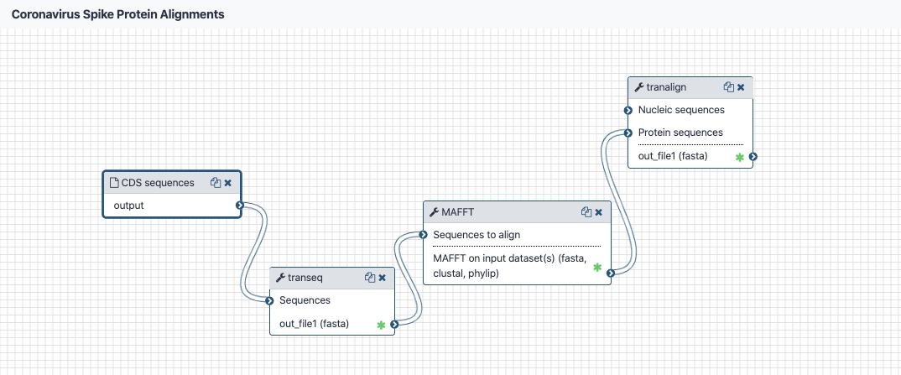

# Alignment of SARS-CoV-2 Spike protein with other Coronaviruses spike proteins

## What's the point?

Aligning Spike protein sequences to detect structural variations and impact of polymorphisms.

## Outline

We used [`MAFFT`](https://mafft.cbrc.jp/alignment/software/), [`Transeq`](https://www.ebi.ac.uk/Tools/st/emboss_transeq/), and [`Transalign`](https://bmcbioinformatics.biomedcentral.com/articles/10.1186/1471-2105-6-156) tools to obtain a proteic alignment and a codon aware nucleic alignment. These alignments allowed us to locate a polymorphisme on a protein and its impact.


## Input

We downloaded CDS sequences of coronavirus Spike proteins from [NCBI](https://www.ncbi.nlm.nih.gov/). We selected related betacoronaviruses, Bat SARS-like, SARS, Murine hepatitis, and MERS, with spike proteins of different assembly of 2019-nCoV.

```
FJ588692.1	Bat SARS Coronavirus Rs806/2006
KR559017.1	Bat SARS-like coronavirus BatCoV/BB9904/BGR/2008
KC881007.1	Bat SARS-like coronavirus WIV1
KT357810.1	MERS coronavirus isolate Riyadh_1175/KSA/2014
KT357811.1	MERS coronavirus isolate Riyadh_1337/KSA/2014
KT357812.1	MERS coronavirus isolate Riyadh_1340/KSA/2014
KF811036.1	MERS coronavirus strain Tunisia-Qatar_2013
AB593383.1	Murine hepatitis virus
AF190406.1	Murine hepatitis virus strain TY
AY687355.1	SARS coronavirus A013
AY687356.1	SARS coronavirus A021
AY687361.1	SARS coronavirus B029
AY687365.1	SARS coronavirus C013
AY687368.1	SARS coronavirus C018
AY648300.1	SARS coronavirus HHS-2004
DQ412594.1	SARS coronavirus isolate CUHKtc10NP
DQ412596.1	SARS coronavirus isolate CUHKtc14NP
DQ412609.1	SARS coronavirus isolate CUHKtc32NP
MN996528.1	nCov-2019
MN996527.1	nCov-2019
NC_045512.2   nCov-2019
```

## Output

We produced two alignments, one nucleic and one proteic, of Betacoronavirus spike proteins.

| Alignments of Spike proteins |
|:-------------------------------:|
| |
| **A**. CDS alignments |
| |
| **B**. Protein alignment|

## Workflow

The Galaxy history containing the latest analysis can be found [here](https://usegalaxy.org/u/delphinel/h/coronavirus-spike-proteins-alignments). The workfow for this analysis is available on the public Galaxy [usegalaxy.org](https://usegalaxy.org/u/delphinel/w/cov-alignment) and contain all information about tool versions and parameters.



The first steps are used to sort the fasta files according to description, so that the sequence from same species are grouped together and the alignments are easier to read. This is done through the `FASTA-to-tabular` to transform the fasta file into a tabulated file containing the genome ID, the genome description, and the sequence. We then use the `Sort` tool to order the sequences alphabetically according to the genome description. The `Text reformating` tools allows us to use a `awk` command to transform the tabulated file back into a fasta file.
The `Transeq`  file converts the CDS sequences into proteic sequences. We use `MAFFT` to align these proteic sequences. The output is fed into `tranalign` along with the nucleic sequences. `tranalign` produces a nucleic alignment coherent with the proteic alignment.  

## BioConda

Tools used in this analysis are also available from BioConda:

| Name | Link |
|------|----------------|
| `MAFFT` | [](https://anaconda.org/bioconda/mafft) |
| `EMBOSS:transeq and tranalign` | [](https://anaconda.org/bioconda/emboss) |
