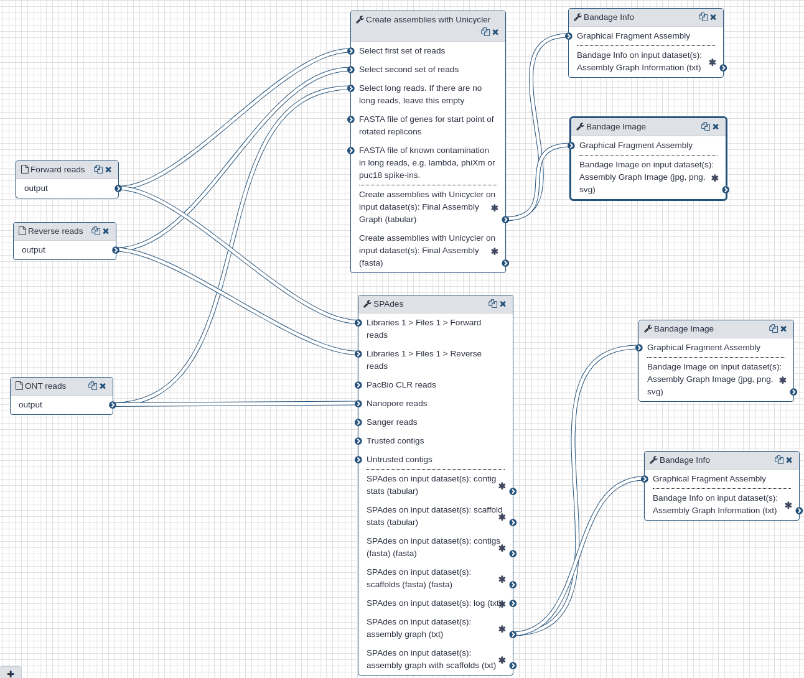

# Assembly of SARS-CoV-2 from PreProcessed Reads

## What's the point?

Use a combination of Illumina and Oxford Nanopore reads to produce SARS-CoV-2 genome assembly.

## Outline

We used Illumina and Oxford Nanopore reads that were pre-processed to remove human-derived sequences. We use two assembly tools: [`spades`](http://cab.spbu.ru/software/spades/) and [`unicycler`](https://github.com/rrwick/Unicycler). While `spades` is a tool fully dedicated to assembly `unicycler` is a "wrapper" that combines multiple existing tools. It uses `spades` as an engine for short read assembly while utilizing [`mimiasm`](https://github.com/lh3/miniasm) and [`racon`](https://github.com/isovic/racon) for assembly of long noisy reads. 

In addition to assemblies (actual sequences) the two tools produce assembly graphs that can be used for visualization of assembly with [`bandage`](https://rrwick.github.io/Bandage/).

## Inputs

Filtered Illumina and Oxford Nanopore reads produced during [pre processing step](https://github.com/galaxyproject/SARS-CoV-2/tree/master/PreProcessing) are used as inputs to assembly tools. 

## Outputs

Each tools produces assembly (contigs) and assembly graph representations. The largest contigs generated by `unicycler` and `spades` were 29,781 and 29,907 nt, respectively and had 100% identity over their entire length.

The following figures show visualization of assembly graphs produced with `spades` and `unicycler`. The complexity of graphs is not surprising given metagenomic nature of underlying samples.

| Assembly graphs for Unicycler (A) and SPAdes (B) |
|:-------------------------------|
| 
| **A**. Unicycler assembly graph |
| 
| **B**. SPAdes assembly graph |

## History and workflow

Galaxy workspace (history) containing the most current analysis can be imported from [here](https://usegalaxy.org/u/aun1/h/ncov-assembly).

The [workflow](https://usegalaxy.org/u/aun1/w/ncov-assembly-1) is available at Galaxy public site and can downloaded and installed on any Galaxy instance. It contains version information for all tools used in this analysis. 

## BioConda

Tools used in this analysis are also available from BioConda:

| Name | Link |
|------|----------------|
| `unicycler` |  |
| `spades` |  |
| `bandage` |  |