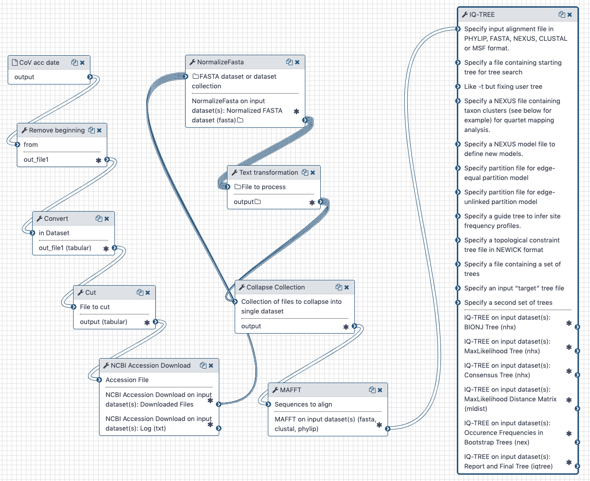

# Dating the most common recent ancestor (MCRA) of SARS-CoV-2

##  What's the point?

To estimate the time of MCRA we use [methodology](https://doi.org/10.1093/bioinformatics/16.4.395) developed by [Andrew Rambaut](https://scholar.google.com/citations?user=JiYPDfoAAAAJ&hl=en&oi=ao).
It correlates an estimate of branch lengths (evolutionary rate) with isolation times of sequences used to construct the tree.

## Outline

This analysis consists of two components - a Galaxy workflow and Jupyter notebook. 

The workflow is used to extract full length sequences of SARS-CoV-2, tidy up their names in FASTA files, produce a multiple sequences alignment and compute a maximum likelihood tree.

The Jupyter notebook is used to correlate branch lengths with collection dates in order to estimate MCRA timing.

## Inputs

One input is required: a comma-separated [file](acc_date.txt) containing accession numbers and collection dates:

```
Accession,Collection_Date
MT019531,2019-12-30
MT019529,2019-12-23
MT007544,2020-01-25
MN975262,2020-01-11
...
```

Such file can be obtained directly from viral resource at NCBI [Viral Resource](https://www.ncbi.nlm.nih.gov/labs/virus/). The collection times are taken from GenBank `/collection_date` tag. 

## Outputs


## History and workflow

Galaxy workspace (history) containing the most current analysis can be imported from [here](https://usegalaxy.org/u/aun1/h/ncov-mcra-timing).

The [workflow](https://usegalaxy.org/u/aun1/w/mcra) is available at Galaxy public site and can downloaded and installed on any Galaxy instance. It contains version information for all tools used in this analysis. 




## BioConda

TTools used in this analysis are also available from BioConda:

| Name | Link |
|------|----------------|
| `picard` | [](https://anaconda.org/bioconda/picard) |
| `mafft` | [](https://anaconda.org/bioconda/mafft) |
| `iqtree` | [](https://anaconda.org/bioconda/iqtree) |

