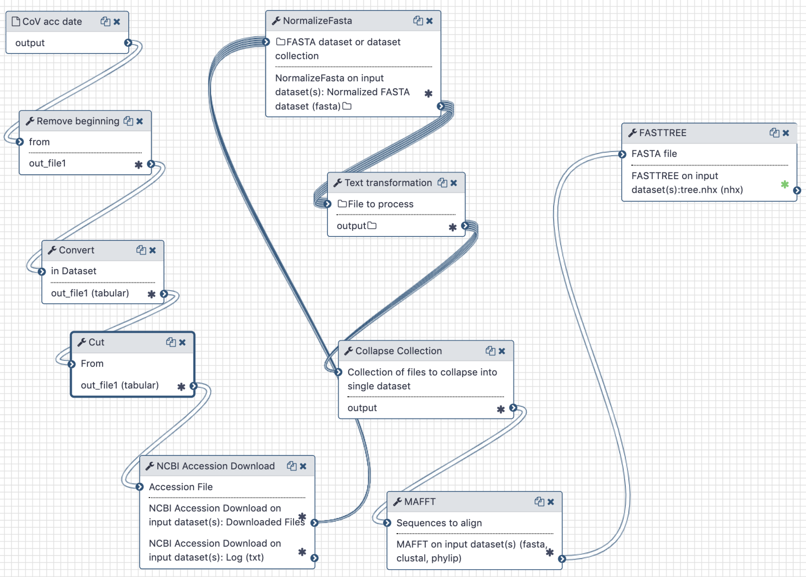

# Dating the most recent common ancestor (MRCA) of SARS-CoV-2

## Live Resources

| usegalaxy.org | usegalaxy.eu | usegalaxy.org.au | usegalaxy.be |
|:--------:|:------------:|:------------:|:------------:|
| [](https://usegalaxy.org/u/aun1/w/mrca) | [](https://usegalaxy.eu/u/wolfgang-maier/w/covid-19-mrca-analysis) | [](https://usegalaxy.org.au/u/simongladman/w/covid-19-mcra) | [](https://usegalaxy.be/u/ieguinoa/w/covid-19-mcra) |
| [](https://usegalaxy.org/u/aun1/h/covid-19-mrca-date) | [](https://usegalaxy.eu/u/wolfgang-maier/h/covid-19-mrca-analysis) | [](https://usegalaxy.org.au/u/simongladman/h/covid-19-mcra) | [](https://usegalaxy.be/u/ieguinoa/h/covid-19-mrca) |
| [](MRCA_Estimation_Notebook.ipynb) | [](MRCA_Estimation_Notebook.ipynb) | [](MRCA_Estimation_Notebook.ipynb) | [](MRCA_Estimation_Notebook.ipynb) |

##  What's the point?

To estimate the time of COVID-19 emergence we use simple root-to-tip regression ([Korber et al. 2000](https://www.ncbi.nlm.nih.gov/pubmed/10846155); more complex and powerful phylodynamics methods could certainly be used, but for this data with very low levels of sequence divergence, simpler and faster methods suffice). From the set of all COVID-19 sequences available as of Feb 16, 2020 we obtain an MRCA date of Oct 24, 2019, which is close to other existing estimates [Rambaut 2020](http://virological.org/t/phylodynamic-analysis-115-genomes-20-feb-2020/356).

## Outline

This analysis consists of two components - a Galaxy [workflow](#history-and-workflow) and a [Jupyter notebook](MRCA_Estimation_Notebook.ipynb). To use a Jupyter Notebook in a Galaxy workflow see these [short instructions](https://galaxyproject.github.io/training-material/topics/galaxy-ui/tutorials/galaxy-intro-jupyter/tutorial.html#open-a-notebook).

The workflow is used to extract full length sequences of SARS-CoV-2, tidy up their names in FASTA files, produce a multiple sequences alignment and compute a maximum likelihood tree.

The Jupyter notebook is used to correlate branch lengths with collection dates in order to estimate MRCA timing.

## Inputs

One input is required: a comma-separated [file containing accession numbers and collection dates](acc_date.csv):

```
Accession,Collection_Date
MT019531,2019-12-30
MT019529,2019-12-23
MT007544,2020-01-25
MN975262,2020-01-11
...
```

An up-to-date version of this file can be generated directly from the [NCBI Virus](https://www.ncbi.nlm.nih.gov/labs/virus/) resource by

1. searching for SARS-CoV-2 (NCBI taxid: 2697049) sequences
2. configuring the list of results to display only the `Accession` and `Collection date` columns
3. downloading the `Current table view result` in `CSV format`

The collection dates will be taken from the corresponding GenBank record's `/collection_date` tag.

## Outputs

The Galaxy workflow generates a maximum-likelihood phylogenetic tree. This tree and the initial workflow input of [accession numbers and collection times](acc_date.csv) are then used in the Jupyter notebook to calculate an estimate of the time to the most recent common ancestor of all samples.

## History and workflow

A Galaxy workspace (history) containing the most current analysis can be imported from [here](https://usegalaxy.org/u/aun1/h/covid-19-mrca-date).

The publicly accessible [workflow](https://usegalaxy.org/u/aun1/w/mrca) can be downloaded and installed on any Galaxy instance. It contains version information for all tools used in this analysis.




## BioConda

Tools used in this analysis are also available from BioConda:

| Name | Link |
|------|----------------|
| `ncbi-acc-download` | [](https://anaconda.org/bioconda/ncbi-acc-download) |
| `picard` | [](https://anaconda.org/bioconda/picard) |
| `mafft` | [](https://anaconda.org/bioconda/mafft) |
| `fasttree` | [](https://anaconda.org/bioconda/fasttree) |
