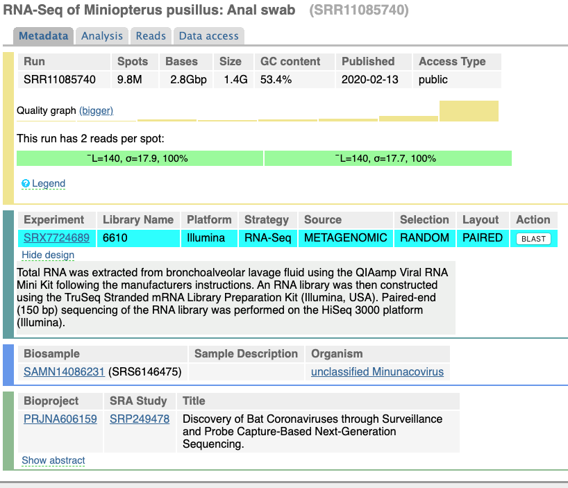
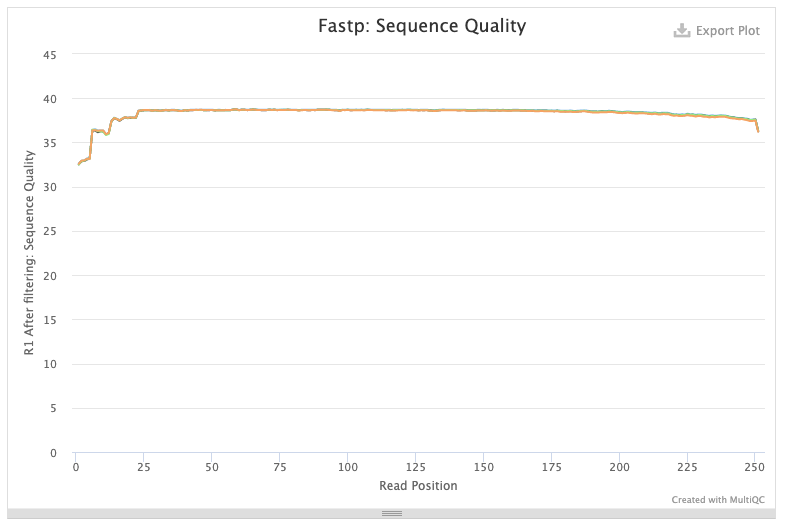
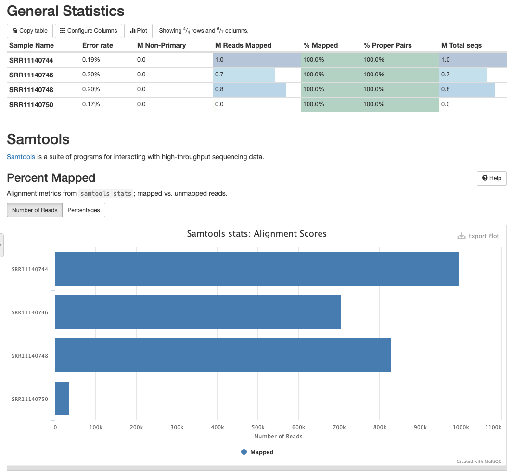
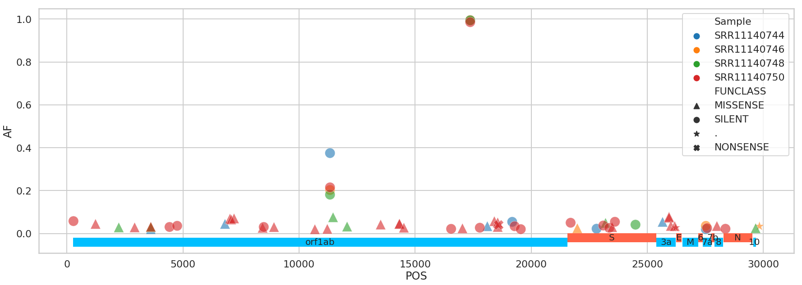

# Analysis of additional data

- [February 21](#february-24-2020-new-data-is-exceptionally-sloppy)
- [February 25](#february-25-new-datasets-from-wisconsin)

## February 21, 2020: New data is exceptionally sloppy

[](https://usegalaxy.org/u/aun1/h/covid-19-feb-21-data-analysis) 

As of the morning of Feb 21, 2020 there are 11 additional datasets that appeared at the [COVID-19 data page](https://www.ncbi.nlm.nih.gov/genbank/sars-cov-2-seqs/) maintained by the [NCBI](https://www.ncbi.nlm.nih.gov/). They can be viewed using [SRA run selector](https://trace.ncbi.nlm.nih.gov/Traces/study/?acc=SRR10903401%2CSRR10903402%2CSRR10902284%2CSRR10948474%2CSRR10948550%2CSRR10971381%2CSRR11092058%2CSRR11092057%2CSRR11092056%2CSRR11092064%2CSRR11085797%2CSRR11085737%2CSRR11085740%2CSRR11085733%2CSRR11085736%2CSRR11085738%2CSRR11085741&o=acc_s%3Aa&s=SRR11085797,SRR10948474,SRR10948550,SRR10903402,SRR11092056,SRR11085741,SRR11085737,SRR11085740,SRR11085738,SRR11085733,SRR10902284,SRR11092064,SRR11092057,SRR11085736,SRR10903401,SRR11092058,SRR10971381).

The accessions of new datasets are:

```
SRR11085797
SRR11092056
SRR11085741
SRR11085737
SRR11085740
SRR11085738
SRR11085733
SRR11092064
SRR11092057
SRR11085736
SRR11092058
```

Of these four (SRR11092056, SRR11092057, SRR11092058, SRR11092064) are human metatranscriptomic samples while others (SRR11085797, SRR11085741, SRR11085737, SRR11085740, SRR11085738, SRR11085733, SRR11085736) are metatranscriptomic samples from bat anal swabs. 

### New human data

First we analyzed the new human sequences represented by SRR11092056, SRR11092057, SRR11092058, SRR11092064. All these datasets share the same bioproject id [PRJNA605983](https://www.ncbi.nlm.nih.gov/bioproject/PRJNA605983). The PRJNA605983 lists a total of nine SRA accessions: five more in addition to the four listed above:

```
SRR11092056
SRR11092057
SRR11092058
SRR11092059
SRR11092060
SRR11092061
SRR11092062
SRR11092063
SRR11092064
```

We attempted to download and analyze these data. It was only possible to download seven datasets from NCBI dues to repeated connection issues:

```
SRR11092056
SRR11092057
SRR11092058
SRR11092060
SRR11092061
SRR11092063
SRR11092064
```

We first processed reads using `fastp` to remove adapters and low quality reads. We then mapped reads against [NC_045512.2](https://www.ncbi.nlm.nih.gov/nuccore/NC_045512) using `bwa mem` and retained only reads mapped in consistent forward/reverse configuration. The following numbers of reads were retained:


###### Mapping statistics obtained with `samtools stats` and `multiqc`.

However, the distribution of reads across genome is extremely uneven as can be seen from the following analysis performed with `deetTools`:


###### Coverage analysis performed with [`deepTools: plotCoverage`](https://deeptools.readthedocs.io/en/develop/content/tools/plotCoverage.html).  

it indicates that with the exception of sample SRR11092057 other samples essentially contain no mapped reads aside from one location at the very end of the COVID-19 genome:


###### Each panel represents one sample (SRR11092056, SRR11092057, SRR11092058, SRR11092060, SRR11092061, SRR11092063, SRR11092064). The coverage is flat at almost 0 until the the very 3' where it spikes sharply. 

Here is a zoomed out view of the 3' region for sample SRR11092056 containing absolute majority of mapped reads:


###### An IGV screen-shot showing reads piling at the 3'-end of COVID-19 genome.

### The bottom line

**New datasets released on Feb 21, 2020 do not contain meaningful COVID-19 sequence data.** In addition, the metadata describing samples is highly questionable. For example, look at the description of another (this time non-human) dataset [SRR11085740](https://trace.ncbi.nlm.nih.gov/Traces/sra/?run=SRR11085740) generated by the same group (WUHAN INSTITUTE OF VIROLOGY, CHINESE ACADEMY OF SCIENCES):



Note that while the description of the dataset lists "RNA-Seq of *Miniopterus pusillus*: Anal swab" the design field contains the following description:

> Total RNA was extracted from bronchoalveolar lavage fluid using the QIAamp Viral RNA Mini Kit following the manufacturers instructions. An RNA library was then constructed using the TruSeq Stranded mRNA Library Preparation Kit (Illumina, USA). Paired-end (150 bp) sequencing of the RNA library was performed on the HiSeq 3000 platform (Illumina).

This leaves the question of whether the sample is derived from a bat anal swab of human bronchoalveolar lavage fluid.

## February 25: New datasets from University of Wisconsin 

[](https://usegalaxy.org/u/aun1/h/covid-19-wisc-data) 
[](wisc.ipynb)

On February 25 we located new data generated by University of Wisconsin - Madison. They are not listed on NCBI's [COVID-19 data page](https://www.ncbi.nlm.nih.gov/genbank/sars-cov-2-seqs/) (**UPDATE** &#8594; As of Feb 28 these datasets are now listed). There are eight datasets:

```
SRR11140744
SRR11140745
SRR11140746
SRR11140747
SRR11140748
SRR11140749
SRR11140750
SRR11140751
```

They are produced by **Katarina Braun** (graduate student in Thomas Friedrich's lab; Twitter: @KATarinambraun;  GitHub: [@katarinabraun](https://github.com/katarinabraun)) and **Gage Moreno** (graduate student in Dave O'Connor's lab; Twitter: @GageKMoreno). Both are from the University of Wisconsin, Madison

This is a description of the samples as specified [here](https://openresearch.labkey.com/wiki/ZEST/Ncov/page.view?name=SARS-CoV-2%20Deep%20Sequencing):

> To characterize within-host viral diversity of this emerging virus, we obtained four SARS-CoV-2 samples from Yoshihiro Kawaoka’s lab:
> A clinical swab obtained from a confirmed case in Madison, WI.
> Cell culture isolates - all having undergone one passage each:
> Vero 76; ATCC CRL-1587
> Vero E6, C1008; ATCC CRL-1586
> Vero STAT-1 KO; ATCC CCL-81-VHG


From these we analyze the following four Illumina datasets (the other four are Oxford Nanopore we did not use in this analysis):

| Accession | Description |
|-----------|------------|
| SRR11140744 | veroSTAT-1KO |
| SRR11140746 | veroE6 |
| SRR11140748 | vero76 |
| SRR11140748 | swab |

We use the same Galaxy workflow described in [Variation](https://github.com/galaxyproject/SARS-CoV-2/tree/master/4-Variation) section of this repository. 

The data are of exceptional quality:



###### Quality of forward reads after `fastp` trimming

and there is a large number of reads mapping against [NC_045512.2](https://www.ncbi.nlm.nih.gov/nuccore/NC_045512):



###### Mapping statistics for SRR11140744, SRR11140746, SRR11140748, SRR1114050

Datasets SRR11140744, SRR11140746, SRR11140748 have high coverage and a large number of low frequency variants:

```
EFFECT          .  NON_SYNONYMOUS_CODING  START_LOST  STOP_GAINED  \
Sample                                                              
SRR11140744  29.0                 2304.0         3.0         25.0   
SRR11140746  22.0                 1604.0         1.0         20.0   
SRR11140748  36.0                 1899.0         2.0         24.0   
SRR11140750   4.0                   76.0         0.0          1.0   

EFFECT       SYNONYMOUS_CODING  
Sample                          
SRR11140744             1594.0  
SRR11140746             1120.0  
SRR11140748             1315.0  
SRR11140750               45.0  
```

Restricting to only variants with frequency above 2% gives much more reasonable counts:

```
EFFECT         .  NON_SYNONYMOUS_CODING  STOP_GAINED  SYNONYMOUS_CODING
Sample                                                                 
SRR11140744  0.0                    4.0          0.0                5.0
SRR11140746  1.0                    2.0          0.0                3.0
SRR11140748  0.0                    6.0          0.0                3.0
SRR11140750  1.0                   24.0          1.0               16.0
```



###### Distribution of variants across COVID-19 genome

The list of variants is available from this [repository](wisc_variants.tsv). The file contains the following columns:

 1. Sample - Sample name
 1. CHROM - always the same value and can be ignored
 1. POS - position of variant (1-based as in VCF files)
 1. REF - Reference allele
 1. ALT - Alternative allele
 1. DP - Depth
 1. AF - Alternative allele frequency 
 1. SB - Strand bias score as reported by `lofreq` (Phred scaled result of Fisher's exact test; the lower - the better)
 1. DP4 - Stranded counts: Ref +, Ref -, Alt +, Alt -
 1. IMPACT - Functional impact of the substitution
 1. FUNCLASS - Functional class of substitution
 1. EFFECT - Effect of the substitution
 1. GENE - Gene Name
 1. CODON - Codon with changes base capitalized 
 1. type - S = SNP, I = Indel, M = MNP

For tools and workflows used in this analysis see [Variation](https://github.com/galaxyproject/SARS-CoV-2/tree/master/4-Variation) section of this repository.


